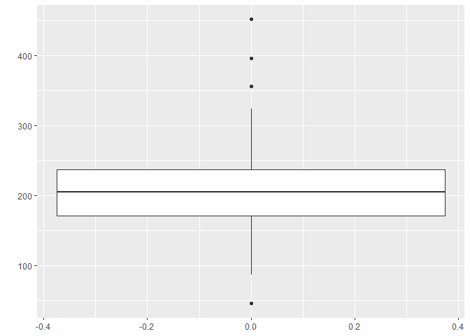
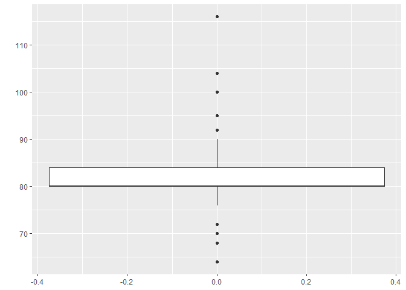
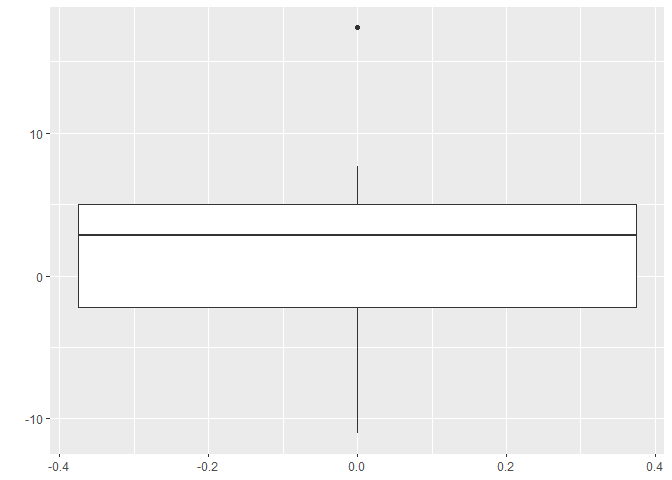

stGOF Package
================

## GitHub Documents

The `stGOF` is designed to Performs the smooth test for the one-sample
goodness-of-fit problem as described by *Rayner et al*.(2009). Both
simple and composite null hypotheses can be tested. The maximum
likelihood (`MLE`) and the method of moments (`MME`) methods for
nuisance parameter estimation are implemented. Function returns the
score statistics of Smooth test result.

The goal of `stGOF` package is to return the smooth test result as
descriped in ***“Smooth Tests of Goodness of Fit Using R”*** book by D.
*John Best, J. C. W. Rayner, and Olivier Thas*.smooth tests and
data-driven smooth tests of goodness of fit can be performed for several
distributions. The package also contains functions for the construction
of sets of orthonormal polynomials.

## Installation

You can install the development version of stGOF from
[GitHub](https://github.com/krakla/stGOF) with:

`install.packages("devtools")`

`devtools::install_github("krakla/stGOF")`

``` r
library(stGOF)
```

## Data

#### PCB dataset

``` r
library(ggplot2)
summary(PRG)
```

    ##      Min.   1st Qu.    Median      Mean   3rd Qu.      Max. 
    ## 0.0000025 0.2478207 0.5007882 0.4990628 0.7486094 0.9999763

``` r
ggplot(data = data.frame(PRG), aes(x = PRG)) + 
  geom_histogram(bins = 30, color = "white", linetype = "longdash")
```

<!-- -->

``` r
p <- ggplot2::ggplot(data = data.frame(PRG), aes(x = PRG)) + 
  geom_boxplot()
p + coord_flip()
```

<!-- -->

``` r
summary(PCB)
```

    ##    Min. 1st Qu.  Median    Mean 3rd Qu.    Max. 
    ##      46     171     205     210     237     452

``` r
ggplot2::ggplot(data = data.frame(PCB), aes(x = PCB)) + 
  geom_histogram(bins = 30, color = "white", linetype = "longdash")
```

<!-- -->

``` r
p <- ggplot2::ggplot(data = data.frame(PCB), aes(x = PCB)) + 
  geom_boxplot()
p + coord_flip()
```

<!-- -->

``` r
summary(pulse)
```

    ##    Min. 1st Qu.  Median    Mean 3rd Qu.    Max. 
    ##    64.0    80.0    80.0    82.3    84.0   116.0

``` r
ggplot2::ggplot(data = data.frame(pulse), aes(x = pulse)) + 
  geom_histogram(binwidth = 12 ,color = "white", linetype = "longdash")
```

<!-- -->

``` r
p <- ggplot2::ggplot(data = data.frame(pulse), aes(x = pulse)) + 
  geom_boxplot()
p + coord_flip()
```

<!-- -->

``` r
summary(cultivars)
```

    ##    Min. 1st Qu.  Median    Mean 3rd Qu.    Max. 
    ## -11.050  -2.175   2.850   2.068   5.025  17.400

``` r
ggplot2::ggplot(data = data.frame(cultivars), aes(x = cultivars)) + 
  geom_histogram(color = "white", linetype = "longdash")
```

    ## `stat_bin()` using `bins = 30`. Pick better value with `binwidth`.

<!-- -->

``` r
p <- ggplot2::ggplot(data = data.frame(cultivars), aes(x = cultivars)) + 
  geom_boxplot()
p + coord_flip()
```

<!-- -->

## Example

This is a basic example which shows you how to calculate smooth test PCB
data which follows the normal distribution and using MLE as an
estimation method

``` r
stGOF(PRG ~ unif, PRG, order = 4, method = "MLE")
```

    ##   Results of the Smooth test
    ##   Ho: Uniform against 4 th order alternative
    ##   Parameter estimation method: MLE 
    ##   Parameter estimates: 2.463115e-06 0.9999763  ( min max )
    ## 
    ## 
    ##   All p-values are obtained by the asymptotical chi-square approximation 
    ## 
    ##     Smooth test statistic S_k : 4.2645 
    ##                p-value        : 1 
    ## 
    ##    1 th theoretically component V_k = -1.01504  p-value = 0.31009 
    ##    2 th theoretically component V_k = -0.30575  p-value = 0.75979 
    ##    3 th theoretically component V_k = -1.42447  p-value = 0.36256 
    ##    4 th theoretically component V_k = -1.05431  p-value = 0.29174

In addition, there are several functions to calculate the MLE, MME
estimators. Also, there are functions can be used to construct of sets
of orthonormal polynomials. For example, here is the MLE estimator for
pulse data.

`norm.MLE(pulse)`

#### Other examples

``` r
stGOF(PCB ~ norm, PCB, order = 4, method = "MLE")
```

    ##   Results of the Smooth test
    ##   Ho: Normal against 4 th order alternative
    ##   Parameter estimation method: MLE 
    ##   Parameter estimates: 210 72.26383  ( mean sd )
    ## 
    ## 
    ##   All p-values are obtained by the asymptotical chi-square approximation 
    ## 
    ##     Smooth test statistic S_k : 9.5588 
    ##                p-value        : 0.0084 
    ## 
    ##    3 th theoretically component V_k = 2.33172  p-value = 0.01972 
    ##    4 th theoretically component V_k = 2.03024  p-value = 0.04233

``` r
stGOF(PCB ~ norm, PCB, order = 6, method = "MLE")
```

    ##   Results of the Smooth test
    ##   Ho: Normal against 6 th order alternative
    ##   Parameter estimation method: MLE 
    ##   Parameter estimates: 210 72.26383  ( mean sd )
    ## 
    ## 
    ##   All p-values are obtained by the asymptotical chi-square approximation 
    ## 
    ##     Smooth test statistic S_k : 10.1826 
    ##                p-value        : 0.03746 
    ## 
    ##    3 th theoretically component V_k = 2.33172  p-value = 0.01972 
    ##    4 th theoretically component V_k = 2.03024  p-value = 0.04233 
    ##    5 th theoretically component V_k = 0.43434  p-value = 0.66404 
    ##    6 th theoretically component V_k = -0.65966  p-value = 0.50947

``` r
stGOF(PCB ~ norm, PCB, order = 7, method = "MLE")
```

    ##   Results of the Smooth test
    ##   Ho: Normal against 7 th order alternative
    ##   Parameter estimation method: MLE 
    ##   Parameter estimates: 210 72.26383  ( mean sd )
    ## 
    ## 
    ##   All p-values are obtained by the asymptotical chi-square approximation 
    ## 
    ##     Smooth test statistic S_k : 10.5948 
    ##                p-value        : 0.06003 
    ## 
    ##    3 th theoretically component V_k = 2.33172  p-value = 0.01972 
    ##    4 th theoretically component V_k = 2.03024  p-value = 0.04233 
    ##    5 th theoretically component V_k = 0.43434  p-value = 0.66404 
    ##    6 th theoretically component V_k = -0.65966  p-value = 0.50947 
    ##    7 th theoretically component V_k = -0.642  p-value = 0.52087

``` r
stGOF(PCB ~ norm, PCB, order = 6, method = "MLE", B = 1000, rescale = TRUE)
```

    ##   Results of the Smooth test
    ##   Ho: Normal against 6 th order alternative
    ##   Parameter estimation method: MLE 
    ##   Parameter estimates: 210 72.26383  ( mean sd )
    ## 
    ## 
    ##   All p-values are obtained by the bootstrap with 1000 runs
    ## 
    ## 
    ##     Smooth test statistic S_k : 10.1826 
    ##                p-value        : 0.024 
    ## 
    ##    3 th empirically rescaled component V_k = 1.49321  p-value = 0.156 
    ##    4 th empirically rescaled component V_k = 1.21281  p-value = 0.088 
    ##    5 th empirically rescaled component V_k = 0.35025  p-value = 0.738 
    ##    6 th empirically rescaled component V_k = -0.97439  p-value = 0.3

``` r
stGOF(PCB ~ norm, PCB, method = "MLE", B = 1000, max.order = 7, horizon="order", criterion="AIC")
```

    ##   Result for Data-Driven Smooth goodness-of-fit test
    ##   Null hypothesis: norm against 7 th order alternative
    ##   Parameter estimation method: MLE 
    ##        Parameter estimates: 210 72.26383  ( mean sd )
    ## 
    ##    Horizon: order 
    ##    Selection criterion: AIC 
    ## 
    ##   All p-values are obtained by the bootstrap with 1000 runs
    ## 
    ##   Data-Driven Smooth test statistic S_k = 9.5588 p-value = 0.026 
    ##   Selected model: 3 4

``` r
stGOF(PCB ~ norm, PCB, method = "MME", B = 1000, max.order = 7, horizon="subset", criterion="BIC")
```

    ##   Result for Data-Driven Smooth goodness-of-fit test
    ##   Null hypothesis: norm against 7 th order alternative
    ##   Parameter estimation method: MME 
    ##        Parameter estimates: 210 72.26383  ( mean sd )
    ## 
    ##    Horizon: subset 
    ##    Selection criterion: BIC 
    ## 
    ##   All p-values are obtained by the bootstrap with 1000 runs
    ## 
    ##   Data-Driven Smooth test statistic S_k = 5.43692 p-value = 0.032 
    ##   Selected model: 3
